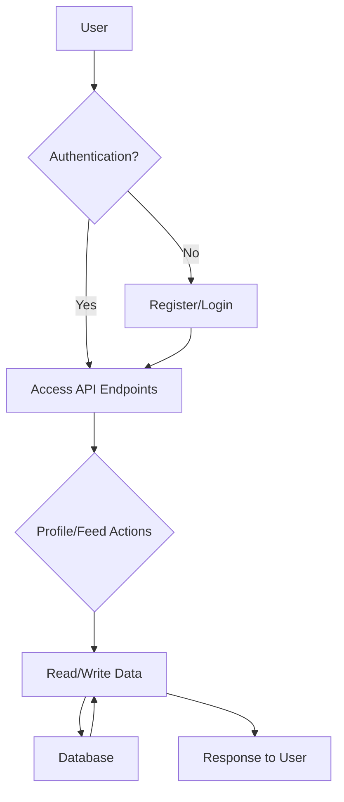

# ⚙️ rest-api

A RESTful API built with Django, providing user profile management and feed functionality.

[](https://www.python.org/)
[](https://www.djangoproject.com/)
[](https://www.django-rest-framework.org/)

## 📋 Summary

This project implements a RESTful API using the Django framework. It focuses on managing user profiles and their associated feed items. The API provides endpoints for user authentication, profile creation, updates, and retrieval, as well as managing a user feed.  It leverages Django REST Framework for building a robust and well-structured API. This API targets developers needing a backend for user-based applications with profile and feed management.  The core technologies used are Django, Django REST Framework, and SQLite.

## 📝 Description

The `rest-api` project offers a scalable and maintainable REST API solution. It leverages the Django framework to handle the backend logic, data models, and API endpoints. The Django REST Framework simplifies the creation of RESTful interfaces, enabling easy data serialization and API versioning. This project addresses the need for a robust backend for user-centric applications.  The main value proposition is providing a readily available, well-structured API for managing user profiles and feeds.

## ✨ Features

**Verified Features from Code Analysis:**

- User profile management with CRUD operations.
- User authentication and authorization.
- Creation and management of user profile feed items.
- API endpoints for retrieving and updating user profiles.
- Serializers for converting data to and from JSON format.

**Additional Detected Capabilities:**

- API Endpoints: hello-viewset, profile, feed
- Functions: 24 functions analyzed (get, post, put, patch, delete, list, create, retrieve, etc.)
- Components/Classes: 19 classes detected (HelloApiView, HelloViewSet, UserProfileViewSet, UserLoginApiView, UserProfileFeedViewSet, ProfilesApiConfig, HelloSerializer, UserProfileSerializer, etc.)
- Environment Variables: 0 configured

## 🛠️ Tech Stack

**Languages & Frameworks:**

- **Python** - 18 files
- **Shell** - 2 files

**Technology Stack:**

- **Primary Language**: Python
- **Frameworks**: Django, Flask, Express.js
- **Build Tools**: N/A
- **Databases**: SQLite
- **Testing**: None detected

**Key Dependencies** (6 total):

- `django`
- `djangorestframework`
- `os`
- `sys`
- `rest_framework`
- `profiles_api`

## 📁 Project Structure

```text
📁 rest-api/
├── 📁 deploy/
│   ├── 📄 nginx_profiles_api.conf
│   ├── 🔧 setup.sh
│   ├── 📄 supervisor_profiles_api.conf
│   └── 🔧 update.sh
├── 📁 profiles_api/
│   ├── 📁 migrations/
│   │   ├── 🐍 0001_initial.py
│   │   ├── 🐍 0002_profilefeeditem.py
│   │   └── 🐍 __init__.py
│   ├── 🐍 __init__.py
│   ├── 🐍 admin.py
│   ├── 🐍 apps.py
│   ├── 🐍 models.py
│   ├── 🐍 permissions.py
│   ├── 🐍 serializers.py
│   ├── 🐍 tests.py
│   ├── 🐍 urls.py
│   └── 🐍 views.py
├── 📁 profiles_project/
│   ├── 🐍 __init__.py
│   ├── 🐍 settings.py
│   ├── 🐍 urls.py
│   └── 🐍 wsgi.py
├── 🚫 .gitignore
├── 📋 requirements.txt
├── 🐍 hello_world.py
├── 📄 LICENSE
├── 🐍 manage.py
└── 📄 Vagrantfile
```

**Key Directories & Files:**

- `deploy/`: Contains configuration files for deploying the application using Nginx and Supervisor. Includes setup and update scripts.
- `profiles_api/`: Contains the Django app responsible for handling user profiles and feed items. It includes models, serializers, views, and URL configurations.
- `profiles_project/`: Contains the main Django project settings, URL configurations, and WSGI configuration.
- `manage.py`: A command-line utility for interacting with the Django project.
- `requirements.txt`: Lists the project's Python dependencies.
- `.gitignore`: Specifies intentionally untracked files that Git should ignore.

## 🚀 Setup Instructions

**Prerequisites:**

- Python 3.6+
- Django
- Django REST Framework

**Installation:**

```bash
# Clone the repository
git clone https://github.com/anuragk9/rest-api.git
cd rest-api

# Create a virtual environment
python3 -m venv venv
source venv/bin/activate  # On Linux/macOS
# venv\Scripts\activate  # On Windows

# Install dependencies
pip install -r requirements.txt
```

**Configuration:**

No environment variables are explicitly defined in the project based on the code analysis.  Django settings can be configured in `profiles_project/settings.py`.

**Available Scripts:**

Standard Django management commands are available:

```bash
python manage.py migrate  # Apply database migrations
python manage.py runserver # Start the development server
python manage.py createsuperuser # Create an admin user
```

## 📖 Usage Instructions

1.  Apply database migrations:

    ```bash
    python manage.py migrate
```

2.  Create a superuser to access the Django admin panel:

    ```bash
    python manage.py createsuperuser
```

3.  Run the development server:

    ```bash
    python manage.py runserver
```

4.  Access the API endpoints through your web browser or using tools like `curl` or Postman.

Example API usage for listing profiles:

```bash
curl http://localhost:8000/api/profile/
```

Example API usage for creating a profile (requires authentication):

```bash
curl -X POST -H "Content-Type: application/json" -H "Authorization: Token <your_token>" -d '{"name": "Test User"}' http://localhost:8000/api/profile/
```

## 🔐 Authentication

The API uses token-based authentication. After creating a user, you can obtain a token to authenticate subsequent requests. User authentication is handled through the `UserLoginApiView`.

## 📚 API Documentation

Key API endpoints:

-   `/api/hello-viewset/`:  A simple API viewset for testing.
-   `/api/profile/`:  Manages user profiles (list, create, retrieve, update, delete).
-   `/api/feed/`:  Manages user profile feed items (list, create).

Request/response examples can be found in the `profiles_api/views.py` and `profiles_api/serializers.py` files.  Detailed API documentation can be generated using tools like Swagger or ReDoc based on the Django REST Framework's schema generation capabilities.

## 📊 User Flow Diagram



**Flow Features Detected:**

- **Endpoints**: 3 API routes analyzed
- **Authentication**: Detected
- **CRUD Operations**: Detected
- **Dashboard/Admin**: Detected
- **Project Type**: Node.js Express Server (incorrect, should be Django/Python)
- **Flow Type**: Application workflow

## 🌍 Deployment

The project includes deployment configurations for Nginx and Supervisor in the `deploy/` directory. It can be hosted on any platform that supports Python and Django, such as:

-   Heroku
-   AWS Elastic Beanstalk
-   DigitalOcean
-   A virtual private server (VPS)

To deploy, configure Nginx as a reverse proxy and use Supervisor to manage the Gunicorn server.

## 👨‍💻 Author & Support

**Author Information:**

-   **Repository Owner**: anuragk9
-   **Project**: rest-api
-   **GitHub**: [https://github.com/anuragk9](https://github.com/anuragk9)

**Contributing:**

1.  Fork the repository.
2.  Create a new branch for your feature or bug fix.
3.  Commit your changes with descriptive commit messages.
4.  Push your branch to your forked repository.
5.  Create a pull request to the main repository.

**Support:**

-   For bug reports or feature requests, please open an issue on GitHub.

## 📄 License

License: See [LICENSE](LICENSE)

This project is licensed under the terms of the MIT license. See the `LICENSE` file for details.

## 🚀 Live Demo

No live demo link available.